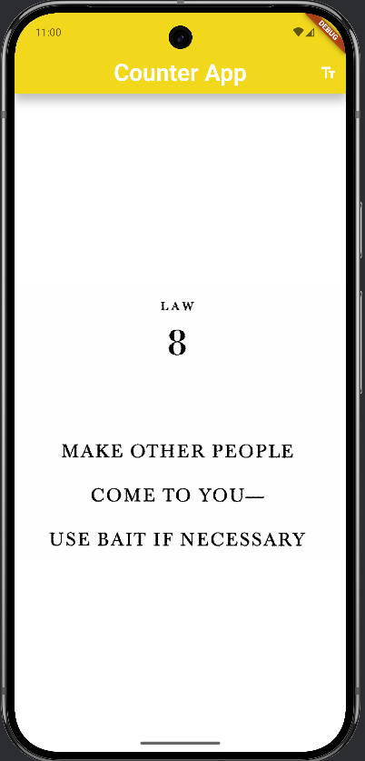
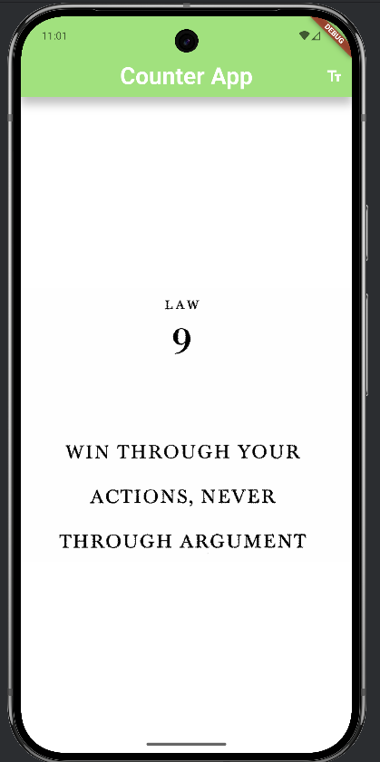
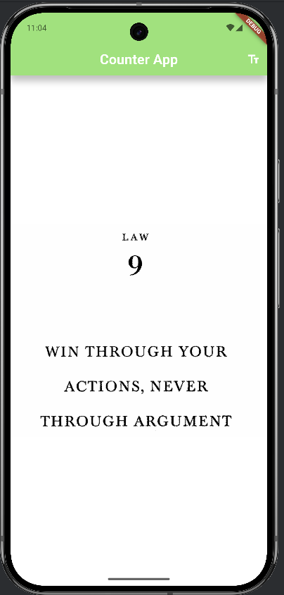
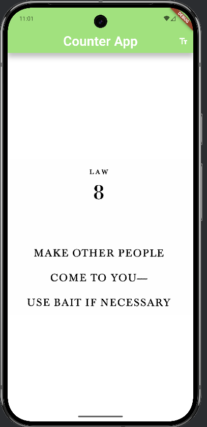

# 🎲 Counter App

A Flutter application demonstrating interactive UI features:

✅ **Random image switching**  
✅ **Dynamic AppBar color changing**  
✅ **Dynamic text size changing**

---

## 📱 **Screenshots**

| Original State | Law Image Changed |
|----------------|-------------------|
|  |  |

| Text Size Changed | AppBar Color Changed |
|-------------------|-----------------------|
|  |  |

---

## 🚀 **Features**

- **Double-tap** on the **AppBar title** to change its text size randomly between **20 to 31**.
- **Tap** on the **AppBar background** to change its color to a random RGB value.
- **Press** the **text fields icon** in the AppBar to increase text size by 3 each time (resets to 20 if above 35).
- **Double-tap** anywhere on the **Law written** to switch to a random Law(`Law7.
png` to `Law11.
png`).

---

## 🔧 **Setup**

1. **Clone the repository:**

```bash
git clone https://github.com/yourusername/flutter_counter_app.git
